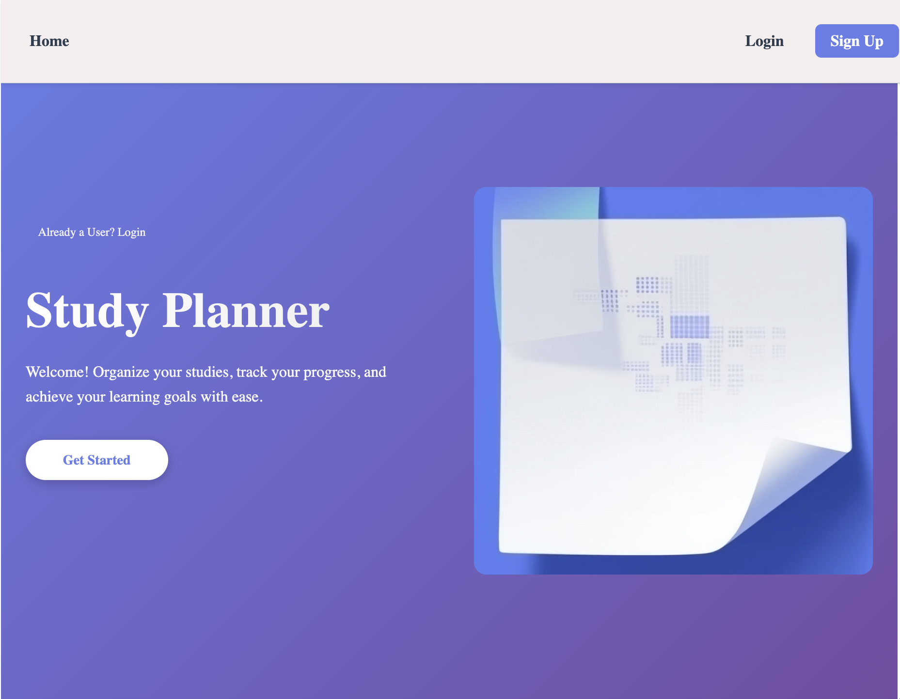

# Study Planner



<!-- Replace the path above with your screenshot or logo -->

## About

Study Planner is a comprehensive web application designed to help students organize their study sessions, track their progress, and manage their learning materials effectively. Built with modern web technologies, this application provides an intuitive interface for managing subjects, creating notes with rich text formatting, and monitoring study statistics.

### Why Study Planner?

In today's fast-paced educational environment, students need effective tools to manage their time and study materials. Study Planner was created to address this need by providing a centralized platform where students can:

- Track their study sessions across multiple subjects
- Create and organize notes with rich text formatting
- Monitor their study statistics and progress
- Stay motivated with visual feedback and goal tracking

### Core Features

- **User Authentication**: Secure sign-up and sign-in functionality
- **Subject Management**: Create, edit, and delete subjects with custom details
- **Rich Note Taking**: Create notes with a powerful rich text editor supporting formatting
- **Study Session Tracking**: Log and monitor study sessions with duration and subject tracking
- **Public User Directory**: Connect with other users in the study community -->
- **Responsive Design**: Seamless experience across desktop and mobile devices
- **Personalized Dashboard**: Quick access to subjects, recent notes, and study statistics

## Getting Started

### Deployed Application

🔗 [Live App]()

<!-- Add your deployed app link here -->

### Planning Materials

📋 [Trello Board](https://trello.com/b/e9LB82Pk/study-planner)

<!-- Add your Trello board link here -->

### Back-End Repository

💾 [Back-End Repo]()

<!-- Add your back-end repository link here -->

### Local Development

To run this project locally:

1. Clone the repository

```bash
git clone [your-repo-url]
cd Study-Planner-front-end
```

2. Install dependencies

```bash
npm install
```

3. Create a `.env` file in the root directory and add your environment variables:

```
VITE_BACK_END_SERVER_URL=your-backend-url
```

4. Start the development server

```bash
npm run dev
```

5. Open your browser and navigate to the local development URL `http://localhost:5173`

## Technologies Used

### Front-End

- **React** (v19.0.0) - JavaScript library for building user interfaces
- **React Router** (v7.1.1) - Client-side routing
- **React Quill** - Rich text editor component
- **Sass** (v1.93.3) - CSS preprocessor for enhanced styling
- **Vite** (v6.0.5) - Fast build tool and development server
- **DOMPurify** - XSS sanitizer for HTML content

### Back-End

<!-- List your back-end technologies here, for example: -->

- **Node.js** - JavaScript runtime
- **Express** - Web application framework
- **MongoDB** - NoSQL database
- **Mongoose** - MongoDB object modeling

### Deployment

- **Front-End**: Vercel
- **Back-End**: Render
- **Database**: MongoDB Atlas

### Development Tools

- **ESLint** - Code linting and quality
- **Vite** - Development server and build tool

## Project Structure

```
Study-Planner-front-end/
├── public/                  # Static assets
├── src/
│   ├── assets/             # Images, fonts, and other assets
│   ├── components/         # React components
│   │   ├── Dashboard/      # Main dashboard component
│   │   ├── Landing/        # Landing page
│   │   ├── NavBar/         # Navigation bar
│   │   ├── NoteEditPage/   # Note editing interface
│   │   ├── NoteForm/       # Note creation form
│   │   ├── NoteList/       # Notes display
│   │   ├── PublicUserList/ # User directory
│   │   ├── SignInForm/     # Authentication - Sign in
│   │   ├── SignUpForm/     # Authentication - Sign up
│   │   ├── StudySessionForm/ # Study session logging
│   │   ├── StudySessions/  # Study sessions display
│   │   ├── StudyStats/     # Statistics visualization
│   │   ├── SubjectDetails/ # Individual subject view
│   │   ├── SubjectForm/    # Subject creation/editing
│   │   └── SubjectList/    # Subjects display
│   ├── contexts/           # React Context providers
│   │   └── UserContext.jsx # User authentication context
│   ├── services/           # API service modules
│   │   ├── authService.js  # Authentication API calls
│   │   ├── studyService.js # Study-related API calls
│   │   └── userService.js  # User-related API calls
│   ├── styles/             # Global styles and variables
│   │   ├── _mixins.scss    # Reusable SCSS mixins
│   │   └── _variables.scss # SCSS variables
│   ├── App.jsx             # Main application component
│   ├── App.scss            # Application styles
│   ├── index.scss          # Global styles
│   └── main.jsx            # Application entry point
├── .env                    # Environment variables
├── eslint.config.js        # ESLint configuration
├── index.html              # HTML template
├── package.json            # Dependencies and scripts
├── README.md               # Project documentation
└── vite.config.js          # Vite configuration
```

## Attributions

- [React Quill] - Rich text editor
- [DOMPurify] - HTML sanitization
  <!-- - Icons and design inspiration from [source if applicable] -->
  <!-- Add any additional attributions here -->

## Next Steps

Planned future enhancements include:

- [ ] Calendar integration for scheduling study sessions
- [ ] Collaborative study groups
- [ ] Flashcard system for quick review
- [ ] Quick access to materials through organazing subjects into folders
- [ ] Export notes to PDF
- [ ] Mobile app version
- [ ] Dark mode theme
- [ ] Study reminders and notifications
- [ ] Integration with popular learning platforms

---

**Developed by**: Natalia Pricop
